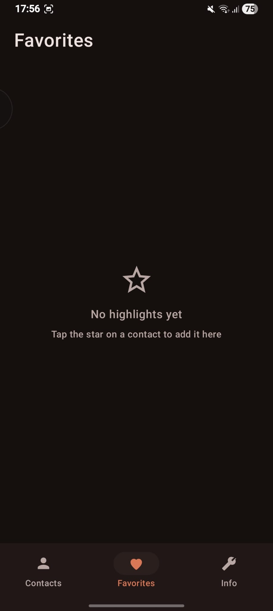
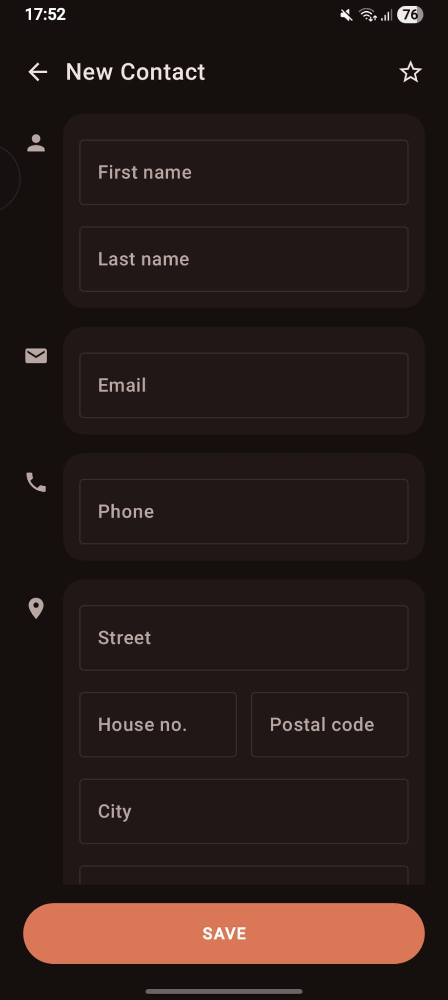
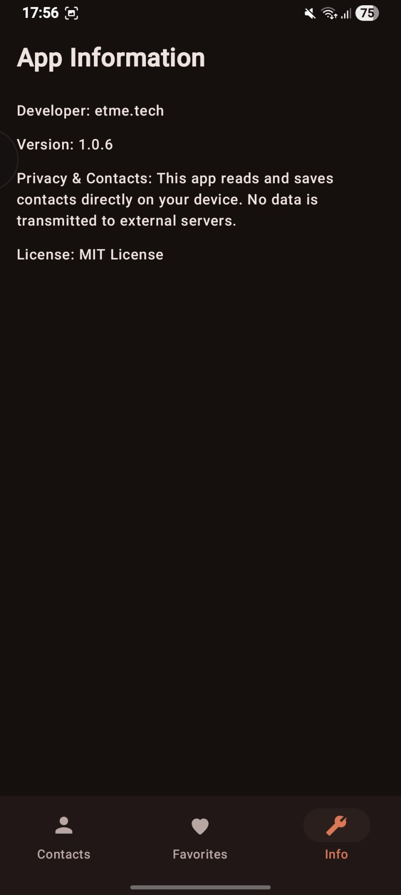

# SimpleContacts

SimpleContacts is a contact management app for Android 7 and above. It is open-source.

SimpleContacts is an app that does not collect your data. It was built with Jetpack Compose. This app. Writes directly to your devices system contacts. So there are no accounts, no ads and no external servers involved.

## Features

- **Contact list**. You can browse all your device contacts. They are grouped alphabetically. There is a fast-scroll alphabet index on the side.

- **Search**. You can quickly filter contacts by name.

- **Favorites (Highlights)**. You can mark contacts as favorites. Then you can view them in a tab.

- **Add / Edit contacts**. You can create contacts or edit existing ones. You can add a lot of details like:

Name

Phone numbers

Email

Full address

Company

Birthday

- **Quick actions**. You can. Email a contact directly from an expandable contact card.

- **System sync**. Contacts are read from. Written to Androids built-in Contacts Provider. So they stay in sync with your device and any other contacts app.

- **Info Tab**. You can find app information

## Screens

## Screens

<table>
  <tr>
    <td></td>
    <td></td>
    <td></td>
    <td></td>
  </tr>
  <tr>
    <td align="center">Contacts</td>
    <td align="center">Favorites</td>
    <td align="center">Add/Edit</td>
    <td align="center">Info</td>
  </tr>
</table>

## Tech Stack

- **Kotlin** is used for SimpleContacts.

- **Jetpack Compose** is used for the UI.

- **Android Contacts Provider** is used for reading and writing system contacts.

- It was built with Gradle.

## Requirements

- You need Android 7.0 or higher.

- You need to give SimpleContacts permission to read and write contacts. This is requested on launch.

## Privacy

SimpleContacts only. Writes contacts stored locally on your device. It uses Androids Contacts Provider. No data is sent to servers. There are no analytics or tracking.

## Getting Started

1. You need to clone the repository. You can do this by running:

```bash

git clone https://github.com/EtmeTech/SimpleContacts.git

```

2. Then you need to open the project in Android Studio.

3. After that you can. Run it on an emulator or physical device.

## License

This project is licensed under the MIT License. You can find the details, in the [LICENSE](LICENSE) file.

## Developer

SimpleContacts was developed by [etme.tech](https://etme.tech).
